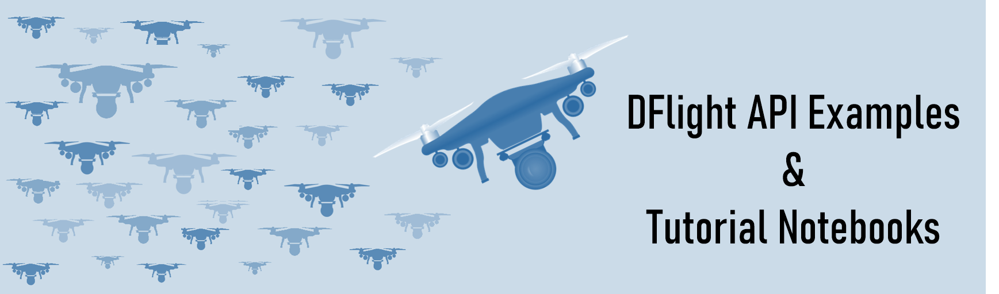

# dflight-examples-python

\
DFlight API supplies the up-to-date information you need for compliance with UAV preflight assessment requirements in the U.S. In this repo you'll find practical examples to help you get started working with DFlight API. 

Make sure to review the DFlight API documentation before getting started:
* [Overview](https://ljaero.com/solutions/dflight/overview/)
* [Developer Resources](https://ljaero.com/solutions/dflight/dev/)
* [OpenAPI Specification](https://dflight-api.ljaero.com/)

And if you're not yet a DFlight subscriber, sign up [here](https://ljaero.com/solutions/dflight/pricing/) (free trial subscription available).

|Subject   | notebook |
| :- | :- |
|Get started with DFlight API|   [dflight_get_started.ipynb](/notebooks/dflight_get_started.ipynb)    |
|Dynamic map interface for DFlight API|  [dflight_interactive.ipynb](/notebooks/dflight_interactive.ipynb)    |
